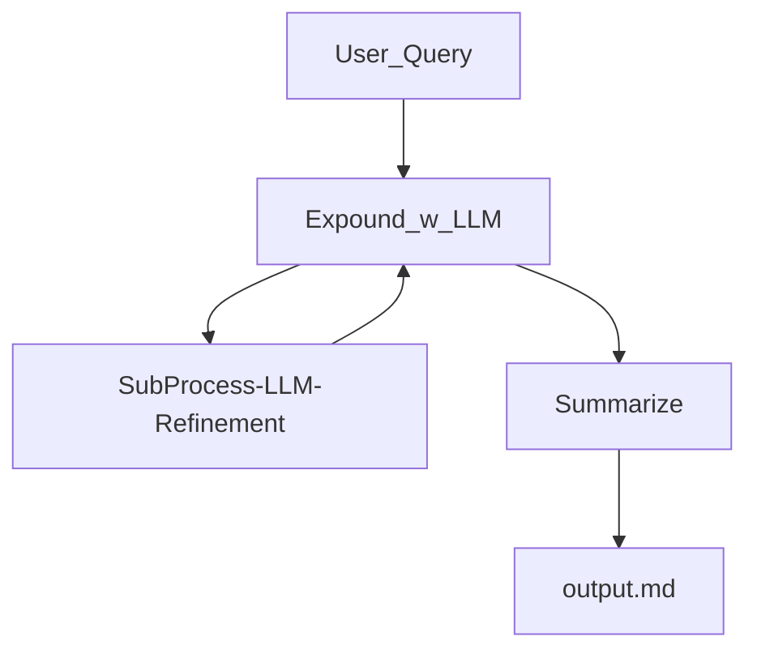
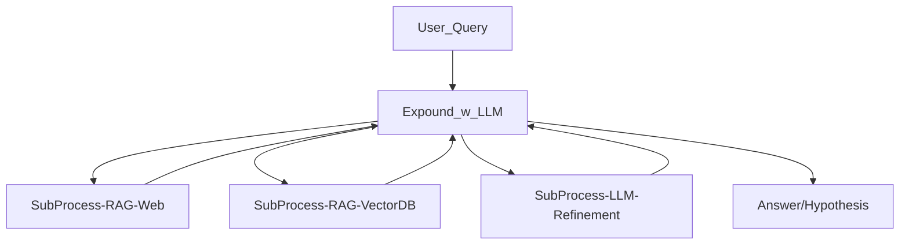

# LLM Researcher 

## Goals 

Enable recursive LLM searches + RAG to assist with understanding a concept. 

### Highlevel concept (Current):




### Highlevel concept (Future):




## Useage 

```
python3 loopy.py -q "Query"
```