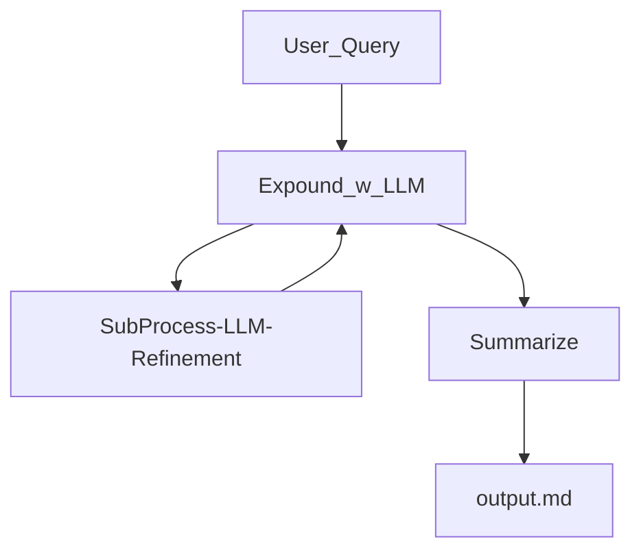
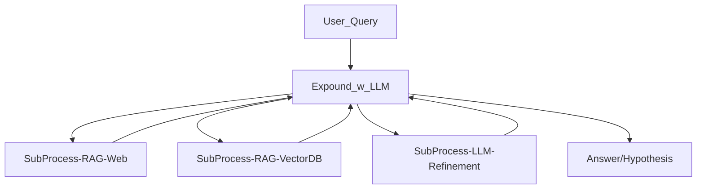

# LLM Researcher 

## Useage 

```
usage: loop.py [-h] [-q Q] [-n_q N_Q] [-n_refine N_REFINE] [-o_dir O_DIR] [-o_file O_FILE] [-debug]

Script with debug flag

options:
  -h, --help          show this help message and exit
  -q Q                Question to research
  -n_q N_Q            N of questions to answer (first refine)
  -n_refine N_REFINE  N of refinement iterations
  -o_dir O_DIR        Output Directory
  -o_file O_FILE      Outputfile
  -debug              Debug Mode
```

Environment and Models 
:   Create an .env file to setup API keys and models. 
:   Recommended models depend on your usecase. 
:   Works with Ollama (local models)


## Goals 

Enable recursive LLM searches + RAG to assist with understanding a concept. 

### Highlevel concept (Current):




### Highlevel concept (Future):




